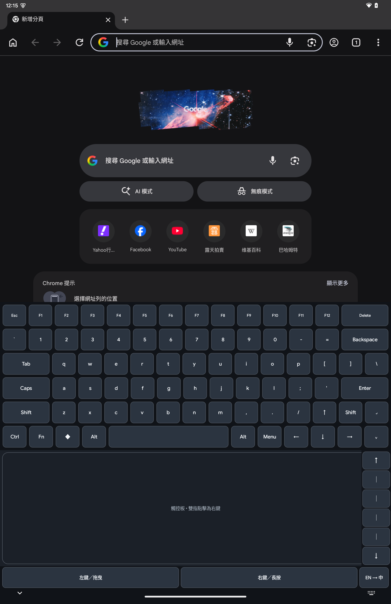
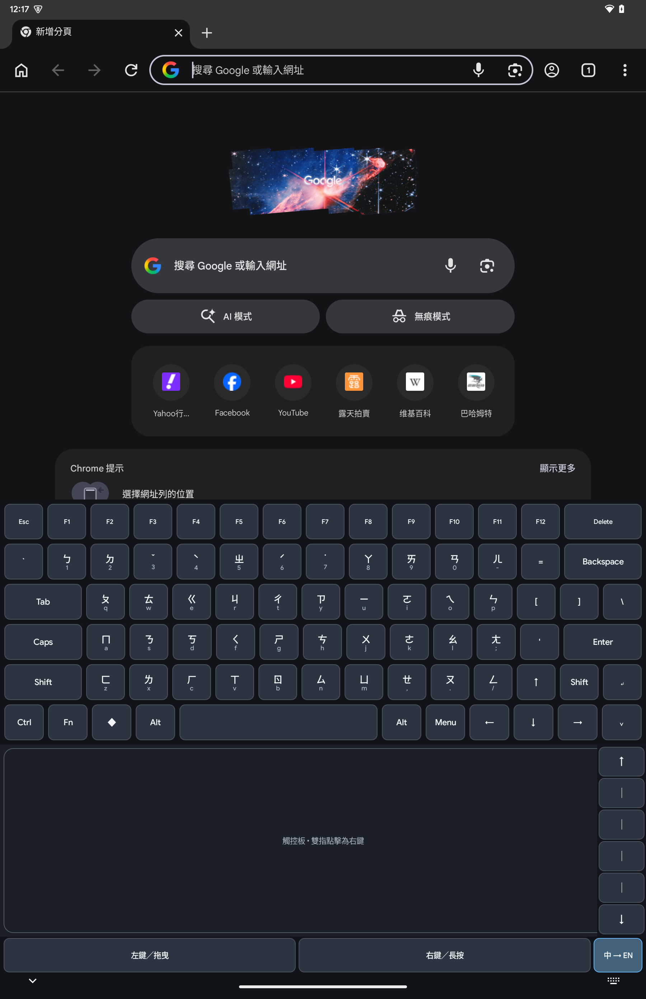
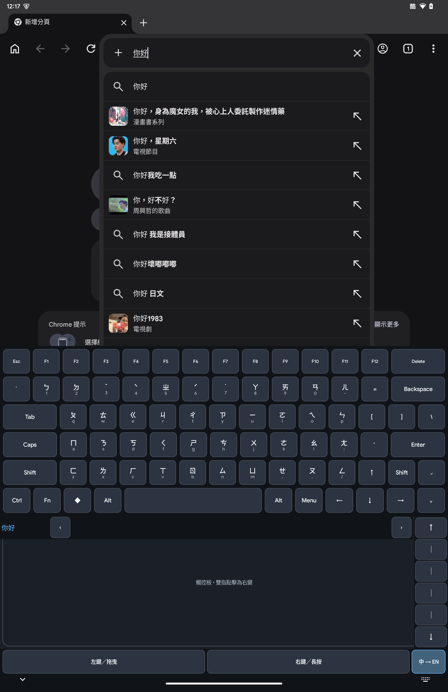

<!--
SPDX-License-Identifier: LGPL-2.1-or-later
SPDX-FileCopyrightText: Copyright 2021-2026 Fcitx5 for Android Contributors
SPDX-FileCopyrightText: Copyright 2026 Surface Duo IME Notebook Contributors
-->

# Surface Duo IME Notebook

[](https://github.com/johnjohn1977/surface-duo-ime-notebook/actions/workflows/android-ci.yml)

把第一代 Microsoft Surface Duo 的下半螢幕變成 notebook 鍵盤、觸控板與捲動控制區。這是一個不需要 root 的 Android 輸入法，英文與繁體中文注音整合在同一套介面中。

Turn the lower display of a first-generation Microsoft Surface Duo into a notebook keyboard, touchpad, and scroll controller. It is a non-root Android input method with English and Traditional Chinese Zhuyin in one interface.

[繁體中文](#繁體中文) · [English](#english)

<p align="center">
  
  
  
</p>

<p align="center">
  英文鍵盤與觸控板 · 注音鍵帽 · 中文組字與候選列<br />
  English keyboard and touchpad · Zhuyin legends · Chinese composition and candidates
</p>

## 繁體中文

### 這是什麼？

Duo Deck 是專為第一代 Surface Duo 製作的實驗性 Android 輸入法。雙 App 使用時，上半螢幕保留給目前操作的 App，下半螢幕則固定顯示 notebook 式輸入介面；App 全螢幕時，同一套鍵盤也能像一般 Android 輸入法一樣出現。

本專案是 [Fcitx5 for Android](https://github.com/fcitx5-android/fcitx5-android) 的產品分支，目前以 upstream `0.1.3`、commit `048f581c652367567b8ee5c28c5163b805288895` 為基礎。

### 已驗證裝置環境

- 裝置：Microsoft Surface Duo 第一代。
- ROM：[DUO-DE Android 15 GSI `v2025.03.11`](https://github.com/Archfx/duo-de/releases/tag/v2025.03.11)，ARM64 A/B GApps、無內建 root 版本（系統識別為 `treble_arm64_bgN`）。
- Android：15 / API 35。
- 系統 build：`AP3A.241105.008`；build stamp `eng.aruna.20250311.020417`。

這是目前完成實機驗收的基準環境，不代表 App 只能在這個 ROM 上執行；其他 ROM、Surface Duo 2 與一般單螢幕手機目前都還沒有相容性保證。

DUO-DE 是由 Archfx 與其貢獻者維護的第三方專案；此處只引用它來記錄測試環境，Duo Deck 並未內含或重新散布 DUO-DE ROM。

### 目前功能

- 六列 notebook 鍵盤，包含 F1–F12、修飾鍵與接近一般鍵帽大小的方向鍵。
- 下半螢幕觸控板：游標移動、點擊、長按、拖曳模式，以及拇指可操作的垂直捲動條。
- 同一套鍵盤直接切換英文與繁體中文注音，不需切換到另一個輸入法 App。
- 透過配套的 Fcitx Chewing plugin 提供中文組字與候選字選擇。
- 雙 App notebook 模式與一般全螢幕 IME 模式共用同一個鍵盤設計。
- 使用 Jetpack WindowManager 解析 Surface Duo 轉軸與工作面板位置，並提供安全的螢幕比例 fallback。
- 不使用 root、Shizuku、hidden API、ROM 修改或常駐 shell daemon。

### Android 整合與隱私

本 App 使用兩個必須由使用者親自同意的 Android 功能：

1. **輸入法服務：**負責鍵盤輸入，讓目標 App 的文字欄位保持焦點。
2. **無障礙服務：**只在解析出的工作面板範圍內發送有限的滑鼠與手勢操作。

無障礙服務不會讀取視窗內容、擷取輸入文字、掃描無障礙節點，也不會建立攔截觸控的 overlay。輸入法與無障礙服務都只能由使用者在 Android 設定中手動啟用。

### 安裝開發版本

從 [Releases](https://github.com/johnjohn1977/surface-duo-ime-notebook/releases) 下載 Duo Deck 主程式與 Chewing plugin APK，分別安裝後：

1. 在 Android 輸入法選擇器中手動啟用並選擇 **Duo Deck (Fcitx)**。
2. 在無障礙設定中手動啟用 **Duo Deck Notebook**。

請勿透過 ADB 自動略過這兩個 Android 同意畫面。

### 使用真正的 notebook mode（雙 App）

真正的 notebook mode 是「一個螢幕顯示目標 App，另一個螢幕顯示 Duo Deck」，不是把普通輸入法放大：

1. 把 Surface Duo 轉成筆電姿勢，讓兩個螢幕上下排列。
2. 在上半螢幕開啟瀏覽器、Terminal 或遠端桌面等目標 App，並點一下要輸入的文字欄位。
3. 在下半螢幕從啟動器開啟 **Duo Deck 筆電鍵盤**，讓兩個 App 同時保持在畫面上。
4. 直接在下半螢幕輸入；Duo Deck 不會搶走上半螢幕的文字焦點。若畫面提示「上半螢幕的 App 目前沒有文字輸入焦點」，再點一次上方的文字欄位即可。
5. 觸控板、左右鍵與右側捲動條會操作解析出的工作螢幕；`EN → 中`／`中 → EN` 可在同一套鍵盤內切換英文與注音。

若只開一個全螢幕 App，Duo Deck 會以一般 Android IME 的方式在文字欄位取得焦點時出現。要回到真正的 notebook mode，請重新讓目標 App 與 **Duo Deck 筆電鍵盤**各佔一個螢幕。

### 開發與建置

因為 Fcitx 引擎使用固定版本的 Git submodule，請用 recursive clone：

```bash
git clone --recurse-submodules \
  https://github.com/johnjohn1977/surface-duo-ime-notebook.git
cd surface-duo-ime-notebook
```

執行測試、建置主程式與 Chewing plugin，並進行 Android lint：

```bash
./gradlew :app:testDebugUnitTest
./gradlew \
  :app:assembleDebug \
  :plugin:chewing:assembleDebug \
  :app:lintDebug
```

APK 會分別輸出到 `app/build/outputs/apk/debug/` 與 `plugin/chewing/build/outputs/apk/debug/`。APK 與本機簽章資料不會提交到原始碼版本庫。

## English

### What is it?

Duo Deck is an experimental Android input method built for the first-generation Surface Duo. In side-by-side app mode, the active app stays on the upper display while a notebook-style input deck remains on the lower display. When an app is full-screen, the same keyboard can appear as a normal Android IME.

This project is a product fork of [Fcitx5 for Android](https://github.com/fcitx5-android/fcitx5-android), currently based on upstream `0.1.3` at commit `048f581c652367567b8ee5c28c5163b805288895`.

### Tested device environment

- Device: first-generation Microsoft Surface Duo.
- ROM: [DUO-DE Android 15 GSI `v2025.03.11`](https://github.com/Archfx/duo-de/releases/tag/v2025.03.11), ARM64 A/B GApps variant without built-in root (reported as `treble_arm64_bgN`).
- Android: 15 / API 35.
- System build: `AP3A.241105.008`; build stamp `eng.aruna.20250311.020417`.

This is the configuration used for current device acceptance testing, not a claim that the app only runs on this ROM. Other ROMs, Surface Duo 2, and ordinary single-screen phones do not yet have a compatibility guarantee.

DUO-DE is a third-party project maintained by Archfx and its contributors. It is referenced only to document the test environment; Duo Deck does not contain or redistribute the DUO-DE ROM.

### Current features

- Six-row notebook keyboard with F1–F12, modifiers, and near-standard-size arrow keys.
- Lower-display touchpad with pointer movement, tap, long-press, drag mode, and a thumb-operated vertical scroll strip.
- English and Traditional Chinese Zhuyin switching inside the same keyboard—no second input-method app.
- Chinese composition and candidate selection through the matching Fcitx Chewing plugin.
- One keyboard design shared by side-by-side notebook mode and normal full-screen IME mode.
- Surface Duo hinge and work-panel geometry through Jetpack WindowManager, with a safe aspect-ratio fallback.
- No root, Shizuku, hidden Android APIs, ROM changes, or background shell daemon.

### Android integration and privacy

The app uses two Android capabilities that remain under explicit user control:

1. **Input method service:** owns keyboard input so the target editor keeps focus.
2. **Accessibility service:** dispatches bounded pointer gestures only inside the resolved work panel.

The Accessibility service does not retrieve window content, capture typed text, inspect the accessibility tree, or create a touch-blocking overlay. Android Settings remains the only place where the user can enable the IME and Accessibility service.

### Install a development build

Download both the Duo Deck app and Chewing plugin APKs from [Releases](https://github.com/johnjohn1977/surface-duo-ime-notebook/releases), install them, then:

1. Manually enable and select **Duo Deck (Fcitx)** in Android's input-method picker.
2. Manually enable **Duo Deck Notebook** under Accessibility settings.

Do not automate either Android consent screen with ADB.

### Use true notebook mode (two apps)

True notebook mode means “the target app on one display and Duo Deck on the other,” not an enlarged ordinary keyboard:

1. Rotate the Surface Duo into a laptop posture so the displays are arranged vertically.
2. Open the target app—such as a browser, terminal, or remote desktop—on the upper display and tap its text field.
3. From the launcher on the lower display, open **Duo Deck Notebook** so both apps remain visible.
4. Type on the lower display. Duo Deck deliberately does not steal the upper app's editor focus. If it reports that no input target is active, tap the upper text field once more.
5. The touchpad, mouse buttons, and right-hand scroll strip operate inside the resolved work display. Use `EN → 中` / `中 → EN` to switch English and Zhuyin within the same keyboard.

With only one full-screen app open, Duo Deck behaves like a normal Android IME and appears when a text field is focused. To return to true notebook mode, place the target app and **Duo Deck Notebook** on separate displays again.

### Development and build

Clone recursively because the Fcitx engines are pinned Git submodules:

```bash
git clone --recurse-submodules \
  https://github.com/johnjohn1977/surface-duo-ime-notebook.git
cd surface-duo-ime-notebook
```

Run the unit tests, build the app and Chewing plugin, and run Android lint:

```bash
./gradlew :app:testDebugUnitTest
./gradlew \
  :app:assembleDebug \
  :plugin:chewing:assembleDebug \
  :app:lintDebug
```

The APKs are written below `app/build/outputs/apk/debug/` and `plugin/chewing/build/outputs/apk/debug/`. APKs and local signing material are intentionally excluded from source control.

## Project status / 專案狀態

The current prototype is device-tested on Surface Duo generation 1. It is a preview and has no compatibility claim for Surface Duo 2 or ordinary single-screen phones.

目前原型已在第一代 Surface Duo 上完成實機測試，仍屬預覽版本；不保證支援 Surface Duo 2 或一般單螢幕手機。

See [UPSTREAM.md](UPSTREAM.md) for provenance and local baseline fixes. Development and review expectations are documented in [CONTRIBUTING.md](CONTRIBUTING.md). Please report sensitive problems through the process in [SECURITY.md](SECURITY.md), not a public issue.

上游來源與基礎修正請見 [UPSTREAM.md](UPSTREAM.md)，開發及審查方式請見 [CONTRIBUTING.md](CONTRIBUTING.md)。敏感問題請依 [SECURITY.md](SECURITY.md) 回報，不要建立公開 issue。

## License / 授權

This fork retains the upstream project license and third-party notices. See [LICENSE](LICENSE) and the licenses in the pinned submodules.

本分支保留上游專案授權與第三方聲明，詳情請見 [LICENSE](LICENSE) 及固定版本 submodule 內的授權文件。
